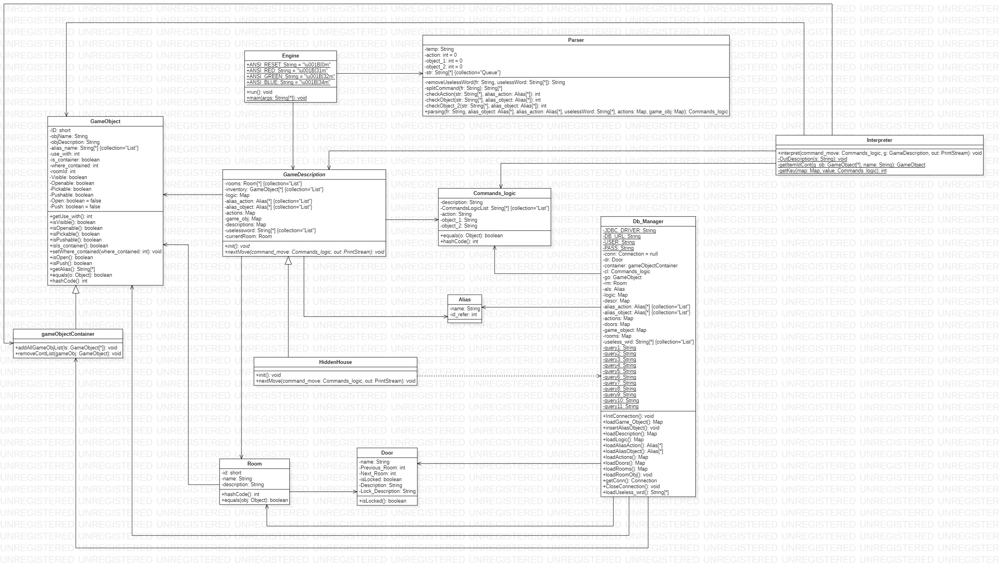

# Hidden House
# Sommario
 1. Introduzione
 2. Requisiti progettuali
 3. Descrizione della base di dati
 4. Caratteristiche tecniche e classi realizzate
 5. Specifiche algebriche
 6. Concetti teorici utilizzati
 7. Design del Sistema
 8. OO Design
 9. Manuale Utente
 
# 1. Introduzione
Nell'ambito del corso di studi di **Metodi Avanzati di Programmazione** è stato realizzato un motore di gioco per avventure testuali, facendo uso del linguaggio **Java** e del tool **Maven** per l'automazione del progetto.

L'avventura testuale che abbiamo creato trae ispirazione da un famoso gioco per PlayStation2 chiamato Project Zero. Il gioco tratta di fantasmi, esorcismi ed oscuri rituali shintoisti. A tal proposito abbiamo ispirato l'ambientazione del gioco alle ville presenti in Project Zero cercando di riportare le medesime ambientazioni buie e claustrofobiche.

# 2. Requisiti progettuali
Il sistema progettato deve soddisfare le seguenti specifiche:
* Definire i componenti di un'avventura ed essere in grado di eseguirla correttamente
* Interpretare in maniera corretta i comandi forniti dall'utente
* Essere in grado di eseguire diverse avventure testuali senza dover necessariamente modificare la stragrande maggioranza 
del codice

# 3. Descrizione della base di dati
Le tabelle presenti nella base di dati realizzata sono le seguenti:

Di seguito si riportano le strutture di ogni tabella:
+ **Tabella action_alias**  
+ **Tabella alias_object**  
+ **Tabella commands**  
+ **Tabella description**  
+ **Tabella doors**  
+ **Tabella game_logic**  
+ **Tabella game_object**  
* **Tabella rooms**  
+ **Tabella useless_words**  

# 4. Caratteristiche tecniche e classi realizzate
L'idea alla base del funzionamento del motore di gioco da noi creato è il caricamento dell'intera avventura testuale tramite il sopracitato database, contenente:
* La logica del gioco
* I comandi primitivi (comandi che verranno interpretati dal parser)
* Gli oggetti del gioco
* Gli alias dei comandi 
* Gli alias degli oggetti di gioco
* Le descrizioni del gioco (delle stanze, degli oggetti e delle porte)
* Le stanze dell'avventura
* Le porte che dividono una stanza dall'altra
* Le parone considerate "inutili" (per il parser) per permettere al giocatore di impartire i comandi in maniera più simile al linguaggio naturale

Risulta così possibile occuparsi solo della progettazione dell'avventura senza badare troppo alla modifica del codice sorgente che seppure ridotta all'osso risulta essere necessaria (sarà necessario modificare un solo metodo dell'intero motore per poterlo adattare di volta in volta ad una nuova avventura).

Ai fini dell'effettiva realizzazione del motore di gioco si è reso necessario creare una serie di classi che rispettano la realizzazione su DB:
+ **Alias**: contenente l'alias stesso e l'id dell'oggetto/comando a cui fa riferimento
+ **Commands_logic**: contiene la logica dei comandi restituiti dal parser
+ **Door**:  per una specifica porta definisce la stanza seguente, se questa è bloccata ed eventualmente delle descrizioni
+ **GameObject**: delinea gli attributi e le proprietà di un oggetto di gioco
+ **gameObjectContainer**: sottoclasse di GameObject, definisce la struttura dei contenitori di gioco
+ **Room**: contiene tutte le proprietà di una stanza

Per scaricare i dati dal database, si è reso necessario creare la classe **Db_Manager**, che si occupa di instaurare la connessione con il DB, scaricare i dati necessari e poi chiude la connessione.

L'inizializzazione della mappa di gioco (con tutte le sue stanza e oggetti per stanza) è stata delegata alla classe concreta **HiddenHouse** che a sua volta estende la classe astratta **GameDescription**.

Per l'interpretazione dei comandi impartiti dall'utente in linguaggio semi-naturale è stata creata la classe **Parser** che ha il compito di prendere la frase scritta dall'utente, alla quale vengono rimossi tutti gli articoli e le parole inutili, ottenendo una frase del tipo _AZIONE-OGGETTO-OGGETTO_ che viene scomposta in tre token. Si controlla se il primo corrisponde ad uno degli alias delle azioni, in caso positivo si recupera il corrispondente comando primitivo. Si effettua lo stesso procedimento per i restanti due token. Per quanto riguarda i token degli oggetti, nel caso in cui l'alias di un oggetto sia composto da più parole, il parser aggrega i token scomposti e controlla se la loro aggregazione restituisce un alias presente nel DB. Il metodo **parsing** della classe Parser restituisce un oggetto di tipo **Commands_logic** formato per l'appunto da tre stringe, ognugna delle quali contenente rispettivamente un comando primitivo e due oggetti primitivi.

Per quanto riguarda l'avanzamento nell'avventura e il responso del sistema ai vari comandi impartiti dall'utente è stata definita la classe **Interpreter** che con il suo metodo **_interpret_** offre due switch. Il primo permetterà il puro avanzamento nel gioco seguendo la logica impartita dal DB, con il secondo sarà possibile eseguire tutti quei comandi comuni a più azioni di gioco.

# 5. Specifiche algebriche
**Rooms**
| Specifica sintattica |                                      |
| -------------------- | ------------------------------------ |
| Tipi:                | Room, short, String, String, List, List, Object, Object         |
| Operatori:           | Room()-> Room |
|                      | setIid(short) -> short          |
|                      | getId() -> short         |
|                      | setName(String) -> String      |
|                      | getName() -> String      |
|                      | setDescription(String) -> String      |
|                      | getDescription() -> String      |
|                      | addDoor(Object) -> List      |
|                      | getDoors() -> List      |
|                      | addObject(Object) -> List      |
|                      | getObjects() -> List      |

Siano:
* l = lista di Rooms
* l2 = lista di GameObject (oggetti nella stanza)
* l3 = lista di Door (porte nella stanza)
* id = identificativo di Room (stanza corrente)

| Osservazioni         | Costruttori di Rooms        |
| -----------------    | --------------------------- |
|                      | Room()                      |
| setId(l,id)          | Room(l)                     |
| getId(id1)           | if l==null then error   else l |       
| setName(l,name)      | Room(l)                      |
| getName(name2)       | if l==null then error   else l |
| setDescription(l,descr) | Room(l)                      |
| getDescription(l,descr1) | if l==null then error   else l |
| getObjects(l,l2)       | if l==null then error   else if l2==null then error   else l,l2  |
| addObject(l,l2,obj)       | if l==null then error   else if l2==null then error   else Room(l,l2+obj)  |
| getDoors(l,l3)       | if l==null then error   else if l3==null then error   else l,l2  |
| addDoor(l,l3,door)       | if l==null then error   else if l3==null then error   else Room(l,l3+door)  |

| Specifica di restrizione |                                      |
| -------------------- | ------------------------------------ |
| Restriction          |                                      |
| addDoor(Room())      | Error                                |

# 6. Concetti teorici utilizzati
### JDBC ###
E’ l'acronimo di _Java Data Base Connectivity_ ed è lo standard che permette l'indipendenza delle piattaforme anche per le applicazioni che operano su basi di dati. Offre un driver manager che permette l'interrogazione delle basi di dati tramite le query. Nell'ambito del progetto, il database è stato creato ed utilizzato al fine di poter permettere l'esecuzione potenziale di più avventure sfruttando il medesimo motore di gioco. Per questo motivo al lancio del sistema vengono scaricati tutti i dati dal DB mediante una serie di query e una volta scaricati i dati e chiusa la connessione, il gioco prosegue sfruttando i dati scaricati in locale.

### RTTI ###
Sta per _Run-Time Type Identification_ e permette appunto l'identificazione di tipo a runtime. Abbiamo fatto uso della RTTI attraverso la parola chiave _instanceof_ che ci è stata utile in tutte quelle situazioni in cui data una stanza con oggetti di tipo **GameObject** e **gameObjectContainer**, si rendeva necessario applicare comportamenti e operazioni diverse sulla base del fatto che l'istanza corrente specificata dal giocatore fosse un oggetto di gioco o un contenitore di oggetti di gioco.

### Lamba Expressions ###
Le lambda expressions possono essere usate al posto di espressioni di classi anonime, permettono di sfruttare la programmazione funzionale e sono utili quando si rende necessario l'uso di un metodo che verrà utilizzata una sola volta. Così facendo è possibile risparmiarsi l'effettiva definizione e dichiarazione di un metodo che verrà usato una sola volta creando invece una funzione anonima. Abbiamo fatto uso delle espressioni lambda nel file **Interpreter.java** in sostituzione del costrutto _foreach_ poichè nel caso specifico l'uso del foreach non funzionava in maniera corretta con il tipo di dato passato.

# 7. Design del Sistema
Alla base del nostro progetto c'è la volontà di permettere a più sviluppatori di rilasciare la propria avventura testuale senza dover necessariamente adattare l'intero sistema ad essa o scrivere l'intero motore da zero. Per permettere ciò è stato creato un motore di gioco che consente di caricare l'intera avventura tramite una basi di dati. Questo ha permesso di rendere quanto più generale possibile il sistema che carica, istanzia e crea tutti i componenti dell'avventura in maniera automatica dopo aver scaricato i dati da DB. Ne consegue che un ipotetico sviluppatore dovrà occuparsi solo della creazione della base di dati e della modifica del solo metodo _interpret_ della classe **Interpreter** che si occupa della gestione della logica del gioco e dei dati relativi alla base di dati (nome, username e password).
Per consentire questo abbiamo cercato di rispettare il **riuso** (dividendo in maniera distinta tutte le componenti del sistema), la **modificabilità** (sfruttando il caricamento dell'avventura tramite basi di dati) e la **portabilità** (attraverso l'uso del linguaggio Java).

# 8. OO Design
Di seguito si riporta il diagramma delle classi:

# 9. Manuale Utente

Di seguito riportiamo i passi per una corretta installazione di MySql 5.7, configurazione e import
del Db necessario per l'avvio dell'avventura testuale.

WINDOWS
---------------------
**1.** Scaricare e installare MySql 5.7 Server dal sito ufficiale 
**2.** Configurare nome utente e passowrd (ad esempio. lasciare come nome utente 'root' e come password '1234') 
**3.** Aprire MySql server e digitare la password impostata precedentemente  
- Creare un nuovo db chiamato hiddenhouse (_CREATE DATABASE hiddenhouse;_) 
- Chiudere MySql 

**4.** Posizionarsi nella cartella "C:\Program Files\MySQL\MySQL Server 5.7\bin" (cercare il percorso corretto poichè questo è solo un esempio) e da qui aprire il prompt dei comandi di Windows 
**5.**  Digitare _mysql -h 127.0.0.1 -u root -p hiddenhouse>"dgitare qui il percorso del database seguito da hiddenhouse.sql"_ 
- Digitare infine la password impostata precedentemente 

**6.** Nel codice sostituire la password di MySql nella classe DbManager nella variabile PASS 
**7.** L'avventura è pronta per essere avviata e giocata! 

UBUNTU
---------------------
**1.** Installare MySql Server 5.7 con i comandi:  
- _sudo apt update_ 
- _sudo apt install mysql-server_ 
- _sudo mysql_secure_installation_ (Configurare nome utente e passowrd lasciando come nome utente 'root' e come password '1234') 

**2.** Dopo l'installazione avviare MySql con il comando _sudo mysql_ e nel prompt di MySql digitare  
- _ALTER USER 'root'@'localhost' IDENTIFIED WITH mysql_native_password BY 'password';_ (al posto di password inserire la password settata al momento dell'installazione) 
- _FLUSH PRIVILEGES;_ (per applicare i cambiamenti effettuati) 

**3.** Una volta chiuso MySql per rientrare nel prompt sarà necessario digitare _mysql -u root -p_ 
**4.** Creare un nuovo db con questo comando _CREATE DATABASE hiddenhouse;_ 
**5.** Dalla shell di Unix digitare _mysql hiddenhouse < percorso/al/file/hiddenhouse.sql_ 
**6.** L'avventura è pronta per essere avviata e giocata. 

**NOTA IMPORTANTE PER TUTTI I SISTEMI OPERATIVI:**
Durante la compilazione del progetto, il drivere JDBC potrebbe sollevare un'eccezione e non riconoscere il time_zone, per ovviare a questo problema aprire MySql e digitare
- _SET GLOBAL time_zone = '+1:00';_

Poichè il gioco fa uso di caratteri ANSI, al fine di consentire la loro corretta visualizzazione si riportano due soluzioni rispettivamente per Ubuntu e per Windows:
* **Ubuntu**: Per abilitare la corretta visualizzazione dei caratteri ANSI su Linux si consiglia di eseguire il seguente comando nel terminale di Linux **_export LESS="-eRiMX"_** e successivamente avviare il file Hiddenhouse.jar con il comando **java -jar percorso/al/file/Hiddenhouse.jar**
* **Windows**: Per consentire la corretta visualizzazione dei caratteri ANSI su Windows si consiglia di avviare il file Hiddenhouse.jar con il comando **java -jar percorso/al/file/Hiddenhouse.jar** nel terminale **"Windows Terminal"**.
