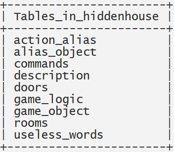
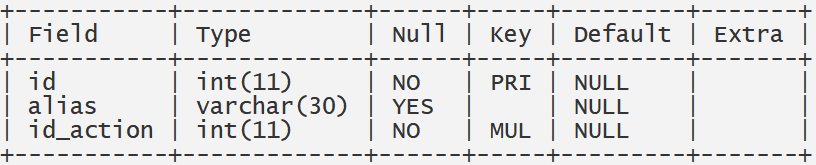
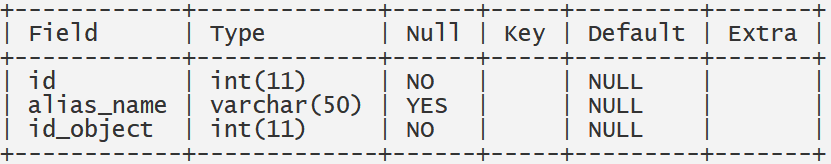
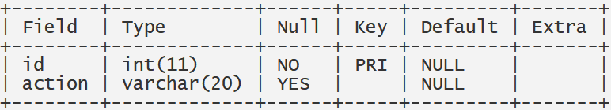
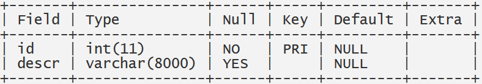
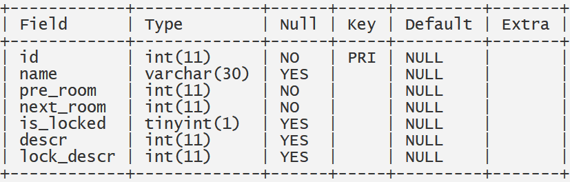
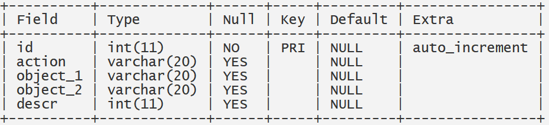
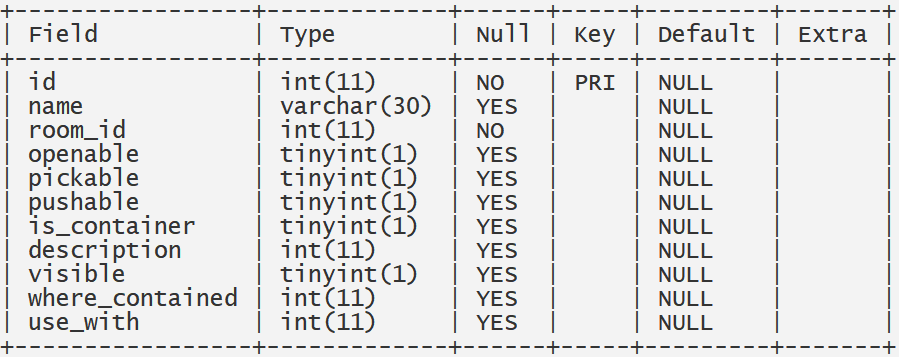
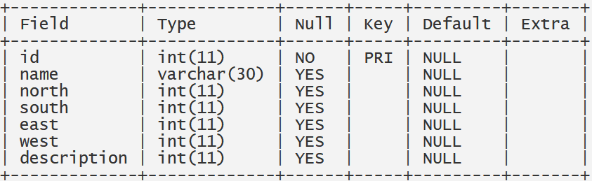
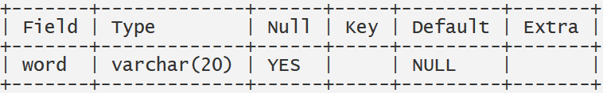

# HiddenHouse
A java text adventure with parser

# Hidden House

# 1. Introduzione
Nell'ambito del corso di studi di **Metodi Avanzati di Programmazione** è stato realizzato un motore di gioco per avventure testuali, facendo uso del linguaggio **Java** e del tool **Maven** per l'automazione del progetto.

# 2. Requisiti progettuali
Il sistema progettato deve soddisfare le seguenti specifiche:
* Definire i componenti di un'avventura ed essere in grado di eseguirla correttamente
* Interpretare in maniera corretta i comandi forniti dall'utente
* Essere in grado di eseguire diverse avventure testuali senza dover necessariamente modificare la stragrande maggioranza 
del codice

# 3. Descrizione della base di dati
Le tabelle presenti nella base di dati realizzata sono le seguenti:

Di seguito si riportano le strutture di ogni tabella:
+ **Tabella action_alias**  
+ **Tabella alias_object**  
+ **Tabella commands**  
+ **Tabella description**  
+ **Tabella doors**  
+ **Tabella game_logic**  
+ **Tabella game_object**  
* **Tabella rooms**  
+ **Tabella useless_words**  

# 4. Caratteristiche tecniche e classi realizzate
L'idea alla base del funzionamento del motore di gioco da noi creato è il caricamento dell'intera avventura testuale tramite il sopracitato database, contenente:
* La logica del gioco
* I comandi primitivi (comandi che verranno interpretati dal parser)
* Gli oggetti del gioco
* Gli alias dei comandi 
* Gli alias degli oggetti di gioco
* Le descrizioni del gioco (delle stanze, degli oggetti e delle porte)
* Le stanze dell'avventura
* Le porte che dividono una stanza dall'altra
* Le parone considerate "inutili" (per il parser) per permettere al giocatore di impartire i comandi in maniera più simile al linguaggio naturale

Risulta così possibile occuparsi solo della progettazione dell'avventura senza badare troppo alla modifica del codice sorgente che seppure ridotta all'osso risulta essere necessaria (sarà necessario modificare un solo metodo dell'intero motore per poterlo adattare di volta in volta ad una nuova avventura).

Ai fini dell'effettiva realizzazione del motore di gioco si è reso necessario creare una serie di classi che rispettano la realizzazione su DB:
+ **Alias**: contenente l'alias stesso e l'id dell'oggetto/comando a cui fa riferimento
+ **Commands_logic**: contiene la logica dei comandi restituiti dal parser
+ **Door**:  per una specifica porta definisce la stanza seguente, se questa è bloccata ed eventualmente delle descrizioni
+ **GameObject**: delinea gli attributi e le proprietà di un oggetto di gioco
+ **gameObjectContainer**: sottoclasse di GameObject, definisce la struttura dei contenitori di gioco
+ **Room**: contiene tutte le proprietà di una stanza

Per scaricare i dati dal database, si è reso necessario creare la classe **Db_Manager**, che si occupa di instaurare la connessione con il DB, scaricare i dati necessari e poi chiude la connessione.

L'inizializzazione della mappa di gioco (con tutte le sue stanza e oggetti per stanza) è stata delegata alla classe concreta **HiddenHouse** che a sua volta estende la classe astratta **GameDescription**.

Per l'interpretazione dei comandi impartiti dall'utente in linguaggio semi-naturale è stata creata la classe **Parser** che ha il compito di prendere la frase scritta dall'utente, alla quale vengono rimossi tutti gli articoli e le parole inutili, ottenendo una frase del tipo _AZIONE-OGGETTO-OGGETTO_ che viene scomposta in tre token. Si controlla se il primo corrisponde ad uno degli alias delle azioni, in caso positivo si recupera il corrispondente comando primitivo. Si effettua lo stesso procedimento per i restanti due token. Per quanto riguarda i token degli oggetti, nel caso in cui l'alias di un oggetto sia composto da più parole, il parser aggrega i token scomposti e controlla se la loro aggregazione restituisce un alias presente nel DB. Il metodo **parsing** della classe Parser restituisce un oggetto di tipo **Commands_logic** formato per l'appunto da tre stringe, ognugna delle quali contenente rispettivamente un comando primitivo e due oggetti primitivi.

Per quanto riguarda l'avanzamento nell'avventura e il responso del sistema ai vari comandi impartiti dall'utente è stata definita la classe **Interpreter** che con il suo metodo **_interpret_** offre due switch. Il primo permetterà il puro avanzamento nel gioco seguendo la logica impartita dal DB, con il secondo sarà possibile eseguire tutti quei comandi comuni a più azioni di gioco.

# 5. Specifiche algebriche
**Rooms**
| Specifica sintattica |                                      |
| -------------------- | ------------------------------------ |
| Tipi:                | Room, short, String, String, List, List, Object, Object         |
| Operatori:           | Room()-> Room |
|                      | setIid(short) -> short          |
|                      | getId() -> short         |
|                      | setName(String) -> String      |
|                      | getName() -> String      |
|                      | setDescription(String) -> String      |
|                      | getDescription() -> String      |
|                      | addDoor(Object) -> List      |
|                      | getDoors() -> List      |
|                      | addObject(Object) -> List      |
|                      | getObjects() -> List      |
